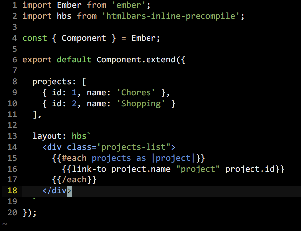

# htmlbars-inline-syntax.vim

Highlight inline hbs tagged template literals using mustache sytax.




## Installation

Use your favorite installation method, such as [Plug](https://github.com/junegunn/vim-plug).


## Usage

In your vimrc:

```vim
autocmd FileType javascript HighlightInlineHbs
```


## License

MIT
